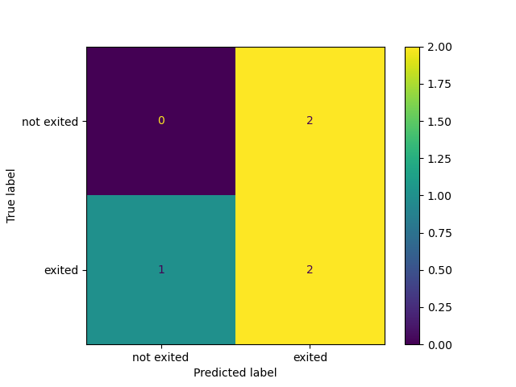
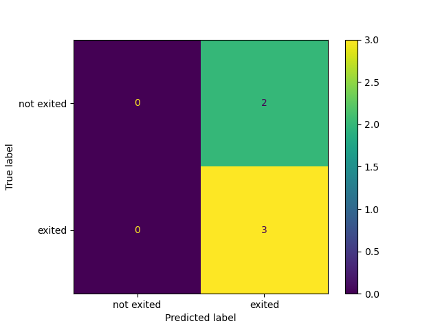

# A Dynamic Risk Assessment System

##  1. <a name='TableofContents'></a>Table of Contents
<!-- vscode-markdown-toc -->
* 1. [Table of Contents](#TableofContents)
* 2. [Project Setup and Installation](#ProjectSetupandInstallation)
* 3. [Overview](#Overview)
* 4. [Project Steps](#ProjectSteps)
	* 4.1. [Data Ingestion: (ingestion.py)](#DataIngestion:ingestion.py)
	* 4.2. [Training, Scoring and Deployment](#TrainingScoringandDeployment)
	* 4.3. [Diagnostics: (diagnostics.py)](#Diagnostics:diagnostics.py)
	* 4.4. [Reporting: (reporting.py, app.py, apicalls.py)](#Reporting:reporting.py)
	* 4.5. [Process Automation (fullprocess.py)](#ProcessAutomationfullprocess.py)
	* 4.6. [Cron Job](#CronJob)
* 5. [Future Improvements](#FutureImprovements)

<!-- vscode-markdown-toc-config
	numbering=true
	autoSave=true
	/vscode-markdown-toc-config -->
<!-- /vscode-markdown-toc -->

##  2. <a name='ProjectSetupandInstallation'></a>Project Setup and Installation
- Create an environment from `environment.yml`
```
conda env create -f environment.yml
```
- Open `config.json`. Ensure that it looks like below
```
{
    "input_folder_path": "practicedata",
    "output_folder_path": "ingesteddata",
    "test_data_path": "testdata",
    "output_model_path": "practicemodels",
    "prod_deployment_path": "production_deployment"
}
```
- Run the setup command
```
$ ./setup.sh
```
- Open another terminal and make API calls
```
$ python -m scripts.apicalls
```
- Edit your [config.json](config.json) to look like below
```
{
    "input_folder_path": "sourcedata",
    "output_folder_path": "ingesteddata",
    "test_data_path": "testdata",
    "output_model_path": "models",
    "prod_deployment_path": "production_deployment"
}
```
Your flask application will restart automatically once you do this! 
- Run the full process
```
$ python -m scripts.fullprocess
```
- Set up the cron job. See [here](#CronJob))
- Hack away!  🔨🔨

##  3. <a name='Overview'></a>Overview
This project builds a simple machine learning system to help a company predict and monitor their customers' attrition risks. The system is served as a REST API that exposes a number of endpoints, the most important of which are the `prediction` and `diagnostic` endpoints by which the the system is used and monitored, respectively. A cronjob is also set up to ensure that a new model is trained once there is new data, compared to the existing production model and promoted, if necessary. For this project, this cronjob runs every 10 minutes. 

##  4. <a name='ProjectSteps'></a>Project Steps
###  4.1. <a name='DataIngestion:ingestion.py'></a>Data Ingestion: (ingestion.py)
Data ingestion is done by globbing the path directory specified as `input_folder_path` in `config.json` for CSV files.
All files found are consolidated into a DataFrame for cleaning. In this project, cleaning simply involves dropping duplicate rows.
Since the entire cleaning logic is contained in a function `clean_dataset`, more cleaning operations can be added as necessary.
The consolidated and cleaned dataset is written to a dated CSV file in the `output_folder_path` specified in `config.json`
and the list of files ingested is written to a text file (ingestedfiles.txt) also.
###  4.2. <a name='TrainingScoringandDeployment'></a>Training, Scoring and Deployment
- Training: (training.py)
  
A `Logistic Regression` model is fit on the latest dataset available in the `output_folder_path`. 
Since the consolidated files from the ingestion step have dated filenames, the latest dataset is easily found by sorting
filenames and indexing the rightmost one. 
Two other important operations occur in this section. First, the column `corporation` is dropped because it is not useful for training.
Also, the dataset is split into training and validation sets. The output from this train-validation split is usually a dictionary object as shown belon
```
{
    'training: {'X': <x_train_df>: 'y': <y_train_df>},
    'val': {'X': <x_val_df', 'y': <y_val_df>}
}
```
The output may also be a single DataFrame object if `create_val_data` is set to False. The trained model is then persisted to
`output_model_path` using a dated filename.
- Scoring: (scoring.py)

This section reports the performance of the trained model using the `F1-Score` metric. F1-Score, being the harmonic mean
of precision and recall, ensures that the most balanced classifier is chosen for deployment. The performance is reported
in file stored in the `output_model_path`. It should be noted that the model performance is calculated on test data from
`test_data_path` specified in `config.json`.
- Deployment: (deployment.py)
Three artifacts are important for deployment. These are:
  - the trained model (trainedmodel.pkl) which was persisted to `output_model_path`
  - the list of ingested files (ingestedfiles.txt) written to `output_folder_path`
  - the F1-Score of the model (latestscore.txt) written to the `output_folder_path`
These three files are copied from their source folders to `production_deployment` where they are used to serve a REST API.
###  4.3. <a name='Diagnostics:diagnostics.py'></a>Diagnostics: (diagnostics.py)
Maintaining a machine learning system longterm means identifying and solving problems as soon as they come up. Diagnostics offer a way to monitor the vitals of the system so that symptoms of issues are identified quickly. In particular, the following are monitored here:
  - The predictions made by the model
  - Outdated packages in the project environment: This can inform longterm improvements
  - Execution time of the ingestion and training scripts: This affects how much latency the system has.
  - Missing values in training data: Too many missing values in training data may indicate dataset issues downstreams.
  - Summary statistics of the training data: This allows data drift to be monitored.
###  4.4. <a name='Reporting:reporting.py'></a>Reporting: (reporting.py, app.py, apicalls.py)
This section achieves two things. First, it generates a confusion matrix as a visualisation of the model performance. This visualisation is saved as a PNG file to whatever `output_model_path` is specified. 

Here is the confusion matrix for the model trained on data from `./practicedata`



Here is the confusion matrix for the new model trained on data from `./sourcedata`



Secondly, a flask application exposing key aspects of the machine learning system as API endpoints is built in `app.py`. Another script, `apicalls.py `, makes requests of the API endpoints and writes all output to `apireturns.txt`. API calls are made both for the model trained on `practicedata` and `sourcedata`. These files are [API Returns File for Practice Data](practicemodels/apireturns.txt) and [API Returns File for Source Data](models/apireturns.txt).

###  4.5. <a name='ProcessAutomationfullprocess.py'></a>Process Automation (fullprocess.py)
Models may degrade in production for a variety of reasons. New data may also contain evolving client behavior that are important. These are two out of the many reasons why production models may need to be updated. Ensuring that such updates can be achieved as seamlessly as possible (and with as little downtime as possible) is a crucial part of MLOps.
In this project, two possible changes are:
  - New datasets are found in the `input_folder_path`
  In this case, the new datasets are ingested using the logic already defined in `ingestion.py` then a new model is trained using `training.py`.
  - Model drift is observed
  The new model is scored and its F1-Score is compared to that of the production model. If the new model performs better, it is promoted using `deployment.py`.


If a new model is deployed, its performance is visualised by running `reporting.py` to obtain a confusion matrix. Requests are also made to the flask application serving the new model as explained above. See [Reporting](#Reporting:reporting.py).

###  4.6. <a name='CronJob'></a>Cron Job
Process automation also involves setting up a cron job to run `fullprocess.py` every 10 minutes. The cron syntax to achieves this is contained in [mlops_cronjob](mlops_cronjob). A generic version is:
```
*/10 * * * * cd /path/to/your/project/directory; zsh automate.sh >> /Users/theyorubayesian/Desktop/Work/Udacity/adras/logs_'$(date)'.txt 2>&1
```

To install this cronjob, run `crontab -e` in terminal and paste your command in the editor that opens then save. Once this is set up, 

This command enters into the project directory and runs [automate.sh](automate.sh). `automate.sh` is a simple bash script that runs `fullprocess.py` as follows
```
/path/to/your/project/python/executable -m scripts.fullprocess
```

All outputs and/or errors are written to a logs file in the project directory.

It may be necessay to grant `Cron` access to your computer's full disk. See instructions to achieve this [here](https://blog.bejarano.io/fixing-cron-jobs-in-mojave/). This comes with the associated risk that anybody that can access your cronjob can do a lot of damage by changing what it does.


For Windows, use the `Windows Subsystem for Linux` or [Task Scheduler](https://docs.microsoft.com/en-us/windows/win32/taskschd/task-scheduler-start-page) to achieve this automation.

##  5. <a name='FutureImprovements'></a>Future Improvements
- A CLI tool to manage the cronjob: The beginnings of this are contained in `automate.py`. This tool will allow the cronjob to be displayed, edited, or rescheduled. It will also retrieve scheduling information such as the next run time.
- Migration to a database: This will replace the text and CSV files created and improve the project reliability.
